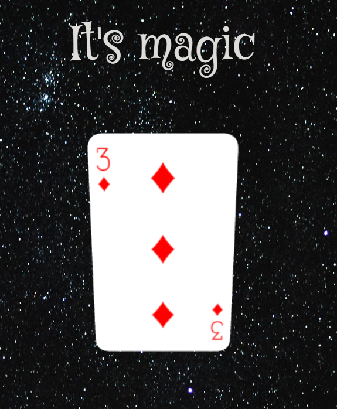

# CardSwap — card-magic HTML app

A small browser-based card-magic demo built with plain HTML, CSS and JavaScript. It displays playing cards and provides interactive effects (textures) used for a card-swap / magic trick UI.

Rotate the card to see the magic happen.

Build with three.js.

Test it here: https://tibo24.github.io/card-magic/

